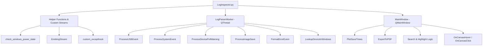

# N.I.N.A. Log Analyzer (`LogInspector.py`) Documentation

The `LogInspector.py` script is a comprehensive desktop GUI utility built with **PyQt5**, **Matplotlib**, and **ReportLab**. It is designed to parse, analyze, and visualize log files generated by **N.I.N.A. (Nighttime Imaging 'N' Astronomy)**. 

The tool enables astrophotographers to diagnose hardware connection issues, driver bottlenecks (device poll lag), image-saving speed degradation, power source transitions (AC vs. Battery), and application errors or crashes.

---

## Table of Contents
1. [Key Features](#1-key-features)
2. [Code Architecture](#2-code-architecture)
3. [Core Processing & Log Parsing Flow](#3-core-processing--log-parsing-flow)
4. [Windows Integrations (PowerShell)](#4-windows-integrations-powershell)
5. [User Interface & Interactive Features](#5-user-interface--interactive-features)
6. [PDF Report Generation](#6-pdf-report-generation)
7. [Dependencies & System Requirements](#7-dependencies--system-requirements)
8. [Usage Guide](#8-usage-guide)

---

## 1. Key Features

- **Asynchronous Parsing**: Uses a background worker thread (`QThread`) so the user interface remains responsive and smooth even when parsing massive log files (tens of megabytes).
- **USB Device Event Tracking**: Identifies when USB devices are connected or disconnected. It resolves raw hardware IDs (VID/PID) into user-friendly device names using a built-in cache dictionary or by querying the Windows device driver database.
- **Windows Power State Auditing**: Correlates N.I.N.A. power events (like `PowerModeChanged`) with actual Windows Kernel-Power event logs, showing whether the system was running on AC grid power or battery.
- **Device Poll Lag Alerts**: Detects when driver update cycles exceed the configured device poll interval and highlights which device caused the delay and for how long.
- **Image Save Metrics**: Analyzes frame-saving steps (`BeforeSave`, `BeforeFinalizeImageSaved`, `FinalizeSaveTime`) and plots durations over time, flagging frames that took exceptionally long (more than 4x the session average) to save.
- **Interactive Visualization**:
  - Plots all phases of image saving (Total, Before Save, Before Finalize, Finalize).
  - Highlights background zones based on different exposure times.
  - Places vertical interactive indicators for device lags (with hover tooltips) and power transitions (with click-to-open warning/info modals).
- **Embedded Console & Search**: Captures standard output (`stdout`) and standard error (`stderr`) to display errors in crimson. Includes a built-in search bar (activated via `Ctrl+F`) supporting forward/backward match navigation, wrap-around, and bright yellow highlight selections.
- **Landscape PDF Export**: Compiles an A4 Landscape PDF containing a clean text dashboard, the analysis plot, a table of device lags, and a table of power state transitions.

---

## 2. Code Architecture

The script is structured into three main layers:



### Main Class & Helper Descriptions

| Class / Function | Type | Description |
| :--- | :--- | :--- |
| `check_windows_power_state(iso_timestamp)` | Global Function | Queries the Windows Event Log using PowerShell to extract Kernel-Power Event 105 (`AcOnline` true/false) within a $\pm$3-second window of the log entry. |
| [EmittingStream](file:///c:/Users/barta/Documents/Python/Astro%20tools/NINAlog/LogInspector.py#L109-L124) | Class (`QObject`) | Intercepts `sys.stdout` and `sys.stderr` and redirects console output as Qt signals. |
| [LogParserWorker](file:///c:/Users/barta/Documents/Python/Astro%20tools/NINAlog/LogInspector.py#L126-L413) | Class (`QThread`) | The background parser. Scans N.I.N.A. logs line-by-line using optimized regular expressions and emits progress and results to the UI. |
| [MainWindow](file:///c:/Users/barta/Documents/Python/Astro%20tools/NINAlog/LogInspector.py#L564-L668) | Class (`QMainWindow`) | Builds the Qt5 UI, manages interactions (buttons, search, clicks/hovers), plots graphs, and generates PDF reports. |
| `custom_excepthook(type, value, tb)` | Global Function | Custom global exception handler that catches uncaught errors and prints their tracebacks directly to the UI logs in crimson. |

---

## 3. Core Processing & Log Parsing Flow

The [LogParserWorker.run()](file:///c:/Users/barta/Documents/Python/Astro%20tools/NINAlog/LogInspector.py#L177-L413) method reads N.I.N.A. log files sequentially. It uses several pre-compiled regular expressions to match specific entries:

1. **Log Header Start Time**: Evaluates the header pattern `^-+([\d]{4}-[\d]{2}-[\d]{2}T[\d]{2}:[\d]{2}:[\d]{2})-+$` to determine when the session was initiated.
2. **USB Devices (`UsbDeviceWatcher`)**: Matches additions or removals. Uses:
   - `DEVICE_DICTIONARY` (predefined map of common astronomy hardware such as ZWO cameras, EAF focusers, and SSDs).
   - If not in the dictionary, queries Windows Drivers via PowerShell (see [Windows Integrations](#4-windows-integrations-powershell)).
3. **Power & System Events**: Matches changes to the system environment such as `PowerModeChanged` or other OS events.
4. **Device Poll Lag warnings**: Regex captures when `DeviceUpdateTimer.cs` reports a value update taking longer than the poll interval.
5. **Exposure Durations**: Captures `Starting Exposure - Exposure Time: <time>s;` to group frames into background color zones.
6. **Image Saving Speed**: Uses `imageSavePattern` to capture times from `ImageSaveController`:
   - **Total Duration**: Overall write time.
   - **BeforeSave**: Overhead before writing.
   - **BeforeFinalizeImageSaved**: Overhead during formatting/pre-allocation.
   - **FinalizeSaveTime**: Disk write duration.
7. **Application Crashes / Errors**: Scans for lines containing `|ERROR|` (excluding `SequenceItem` logs) and enters a collection state. It aggregates all subsequent lines that do not start with a timestamp as part of the stack trace. The block is then formatted with helpful hints highlighting affected systems (e.g., Camera Koeling, Telescoopbesturing).

---

## 4. Windows Integrations (PowerShell)

The N.I.N.A. Log Analyzer features deep OS-level integration designed for Windows-based imaging PCs:

### A. USB Device Querying
If a connected USB hardware ID (VID/PID combination) is not in `DEVICE_DICTIONARY`, the worker calls:
```powershell
Get-CimInstance Win32_PnPSignedDriver | Where-Object DeviceID -like "*<hardwareID>*" | Select-Object Description | ConvertTo-Json
```
This queries the Windows Plug-and-Play driver database to determine the device description (e.g., "ZWO ASI2600MM Pro") and writes a log confirmation: `➕ Toegevoegd aan dictionary: VID_XXXX&PID_XXXX -> 'Device Description'`.

### B. Windows Kernel Power Auditing
When N.I.N.A. logs a power mode transition, the system uses the log event's timestamp to query the Windows Event Log database using:
```powershell
$time = Get-Date '<iso_timestamp>'
Get-WinEvent -FilterHashtable @{
    LogName = 'System'
    ProviderName = 'Microsoft-Windows-Kernel-Power'
    Id = 105
    StartTime = $time.AddSeconds(-3)
    EndTime = $time.AddSeconds(3)
} -ErrorAction SilentlyContinue | ForEach-Object { ... }
```
This extracts the XML payload of **Kernel-Power Event ID 105 (Power State Change)**. It extracts `AcOnline` to confirm if the laptop/PC switched to battery (`AcOnline = false`) or was restored to grid power (`AcOnline = true`).

---

## 5. User Interface & Interactive Features

### Graphical Visualization (Matplotlib Canvas)
The plot provides an interactive timeline representing the frames collected:
- **Save Durations**: Plotted as lines representing each stage of the save lifecycle.
- **Exposure Zones**: The chart background is shaded with alternating pastel colors. It groups consecutive frames with identical exposure settings and labels them with the exposure duration and total frame count.
- **Device Lag Overlay**: Marked by vertical dash-dot lines (orange for lags $<30$s, crimson for lags $>30$s).
  - *Hover Interactivity*: Placing the cursor over a lag line dynamically renders a yellow tooltip showing exactly which devices experienced lag and the duration of each delay.
- **Power Transitions Overlay**: Marked by vertical dashed lines (cyan for AC power, magenta for Battery).
  - *Click Interactivity*: Clicking directly on a power transition line pops up a `QMessageBox` explaining the event details, exact timestamp, and power state verification.

### Text Console & Search Bar
- Standard print statements and exceptions are directed into the UI. Exceptions are colored in **crimson** to draw immediate attention.
- Pressing `Ctrl+F` toggles a compact search panel directly above the console.
- Typing text and hitting **Enter** or **Volgende** (Next) highlights the matching text in **bright yellow** and scrolls the cursor to it.
- Clicking **Vorige** (Previous) runs a backward search.
- The search wraps around automatically to the beginning/end of the document if no further matches exist.

---

## 6. PDF Report Generation

Clicking **Exporteer naar PDF** compiles a landscape A4 document using `ReportLab`:
1. **Font Registration**: Attempts to register `C:\Windows\Fonts\arial.ttf`. If unavailable, it falls back to standard `Helvetica`.
2. **Sanitization**: Before compiling, it replaces Unicode emojis (such as ✔, ❌, ⚠️, ⚡) with clean text tags (`[OK]`, `[FOUT]`, `[WAARSCHUWING]`, `[POWER]`) and ignores non-Latin1 characters to prevent PDF font compilation crashes.
3. **Report Elements**:
   - **Header Section**: Displays the report title and source filename.
   - **Log Summary**: Embeds the parsed text dashboard inside a light grey code block container.
   - **Visual Plot**: Exports the current Matplotlib figure as a high-density temporary PNG and embeds it directly into the PDF page layout.
   - **Device Lags Table**: Generates a grid with timestamp, device description, lag duration, and color-coded impact columns.
   - **Power Events Table**: Formats timestamps, power sources (grid AC power in green vs. battery in crimson), and descriptive OS system messages.

---

## 7. Dependencies & System Requirements

To run `LogInspector.py`, install the following dependencies:

```bash
pip install PyQt5 matplotlib numpy reportlab
```

### Requirements:
- **Operating System**: **Windows** is required for full functionality because the script relies on PowerShell command executions (`Get-CimInstance` and `Get-WinEvent`) to resolve USB device names and audit power events. On non-Windows platforms, these sub-processes will fail silently, and the app will fall back to using default descriptions or labeling power sources as "Onbekend" (Unknown).

---

## 8. Usage Guide

1. **Launch the application**:
   ```bash
   python LogInspector.py
   ```
2. **Open a log file**: Click **Blader naar Logbestand...**. The dialog defaults to N.I.N.A.'s default log directory (`%LOCALAPPDATA%\NINA\Logs`).
3. **Wait for parsing**: A progress bar indicates parsing progress. If new USB devices are found, PowerShell queries will run asynchronously (status reports appear in the text console).
4. **Analyze the results**:
   - Use the Matplotlib graph to locate saving speed anomalies.
   - Hover over vertical lines to inspect device update lags.
   - Click on vertical power lines to verify power loss events.
5. **Search logs**: Press `Ctrl+F` to search for specific terms (e.g., specific errors, filter wheel names, or autofocus runs).
6. **Export**: Click **Exporteer naar PDF** to save a landscape report of the session.
